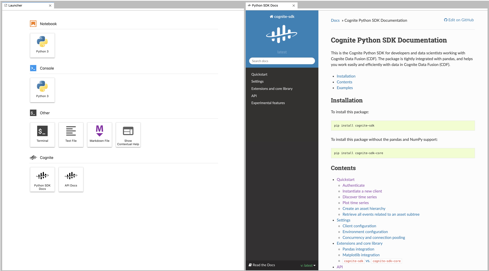

# dshub-cognite-docs

A DSHub extension that provides cognite documentation in separate IFrame widgets that can be freely moved and pinned
around the screen.
The extension provides both launcher icons and menu-items for opening the Python SDK 
and the API documentation.



## Known Issues

* [Fixed] ~~Opening a widget, closing it, then reopening it renders the widget unable to be closed again. A refresh of the page
fixes this~~.
* [Fixed] ~~Restoring the layout on page-refresh may act up. Need to look into how to restore multiple widgets~~
* [Fixed] ~~Icons are hard to see when using the dark theme.~~ Currently needs a refresh for changes to take effect.

## Development instructions
### Requirements

* JupyterLab >= 2.0

### Install

```bash
jupyter labextension install dshub-cognite-docs
```

### Contributing

#### Install

The `jlpm` command is JupyterLab's pinned version of
[yarn](https://yarnpkg.com/) that is installed with JupyterLab. You may use
`yarn` or `npm` in lieu of `jlpm` below.

```bash
# Clone the repo to your local environment
# Move to dshub-cognite-docs directory

# Install dependencies
jlpm
# Build Typescript source
jlpm build
# Link your development version of the extension with JupyterLab
jupyter labextension link .
# Rebuild Typescript source after making changes
jlpm build
# Rebuild JupyterLab after making any changes
jupyter lab build
```

You can watch the source directory and run JupyterLab in watch mode to watch for changes in the extension's source and automatically rebuild the extension and application.

```bash
# Watch the source directory in another terminal tab
jlpm watch
# Run jupyterlab in watch mode in one terminal tab
jupyter lab --watch
```

#### Uninstall

```bash

jupyter labextension uninstall dshub-cognite-docs
```
